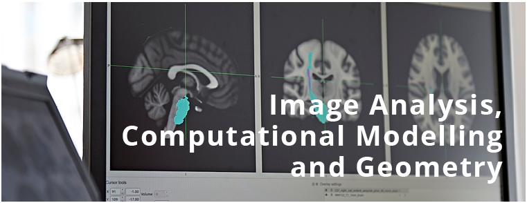

---
# Feel free to add content and custom Front Matter to this file.
# To modify the layout, see https://jekyllrb.com/docs/themes/#overriding-theme-defaults
title:
layout: page
title: Image section
permalink: /
---
## Image Analysis, Computational Modelling, and Geometry

The IMAGE section hosts researchers in image analysis and processing, computer vision, computer simulation, numerical optimization, machine learning, computational modelling, geometry and geometric statistics. The work ranges from theoretical analyses, over algorithm development, to solving concrete problems for science, industry and society. We are part of the recently launched SCIENCE AI Centre at the University of Copenhagen.

For formal information about the IMAGE section please look at our department  [web-site](https://di.ku.dk/english/research/image/). On this site we present public complementary information. Private information for employees can be found on [github](https://github.com/diku-dk/IMAGE).

Want to see what we do? Have a look at some of our publications.

  
  
  <a class="latest-pub" href="https://scholar.google.com/scholar?q={{ publication.title | url_encode }}" target="_blank" rel="noopener noreferrer" title="Search on Google Scholar">
    {{ publication.year }}
    

      <h3 class="latest-pub-title">{{ publication.title }}</h3>
      
{{ publication.author }} &middot; {{ publication.journal }}

    

  </a>
  

[All publications &rarr;]({{ site.baseurl }})

## Student Projects
The section regularly publishes projects for BSc and MSc students.

- [Student Projects]({{ site.baseurl }})

## Infrastructure
IMAGE provides a wide range of physical and virtual reserach infrastructure. 

- [Robot lab space]({{ site.baseurl }})
- [Toolshop]({{ site.baseurl }})
- [GPU Cluster]({{ site.baseurl }})

## Open Data and Open Source
Researchers from IMAGE has been part of creating many open source projects and data-sets that are freely available online. Below is a subset of those repositories.

- [Open-Full-Jaw](https://github.com/diku-dk/Open-Full-Jaw)
- [CarGen](https://github.com/diku-dk/CarGen)
- [LibHip](https://github.com/diku-dk/libhip)
- [DiffCal](https://github.com/diku-dk/DiffCal)
- [OpenTissue](https://github.com/erleben/OpenTissue)
- [PROX](https://github.com/diku-dk/PROX) 
- [PROX MATCHSTICK](https://github.com/erleben/matchstick)
- [Num4LCP](https://github.com/erleben/num4lcp)
- [HessianIK](https://github.com/sheldona/hessianIK)
- [libRAINBOW](https://github.com/diku-dk/libRAINBOW)

