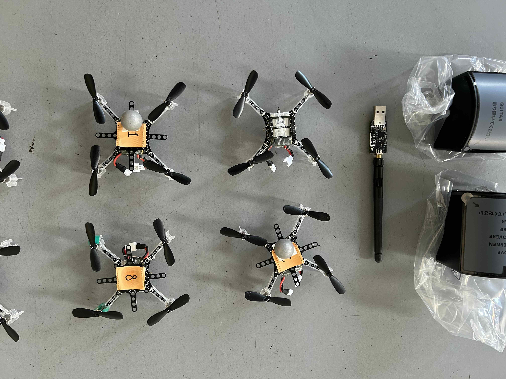

[Crazyflies](https://www.bitcraze.io) are nano drones suitable for experimenting algorithms of generating and controlling the flight trajectories, or coordinative behaviours of a swarm of them. The drones have their own firmware to control the flight stability (with the help of the external positioning system, see below). The programmer can basically focus on commanding the desired waypoints or velocity for the drones to follow. The programs run on a remote computer communicating with drones through [antennas](https://www.bitcraze.io/products/crazyradio-2-0/). The remote computer runs clients supporting Python or C++. See the official [documentation](https://www.bitcraze.io/documentation/tutorials/getting-started-with-crazyflie-2-x/) and [repositories](https://www.bitcraze.io/documentation/repository/) on how to use them. If you are a big fan of the ROS ecosystem, you might want to have a look at this [repo](https://github.com/IMRCLab/crazyswarm2). 

The crazyflie platform cannot support very powerful sensors or onboard computing devices though, due to the limited payload and battery capacity for about 5-7min flying time. If you are seeking for such support, check out our [Holybro]({{ site.baseurl }}) platforms. Unlike Holybro, which mainly flies outdoor, crazyflies focus on indoor experimentation and do not have the access to GPS to position themselves. They can hence not hover unless some external sensor systems tell them that they are drifting. To achieve that, you can do either of these in the lab space:

* Mount [Mocap]({{ site.baseurl }}) markers on the drone; Read and redirect the tracked frame position to the dron via antennas.
* Mount the lighthouse positioning deck to the drones; Use the [lighthouse](https://www.bitcraze.io/documentation/tutorials/getting-started-with-lighthouse/) system to let the drone make sense of its location. The location data can be broadcasted from the drone to computers for the usage of algorithms.

