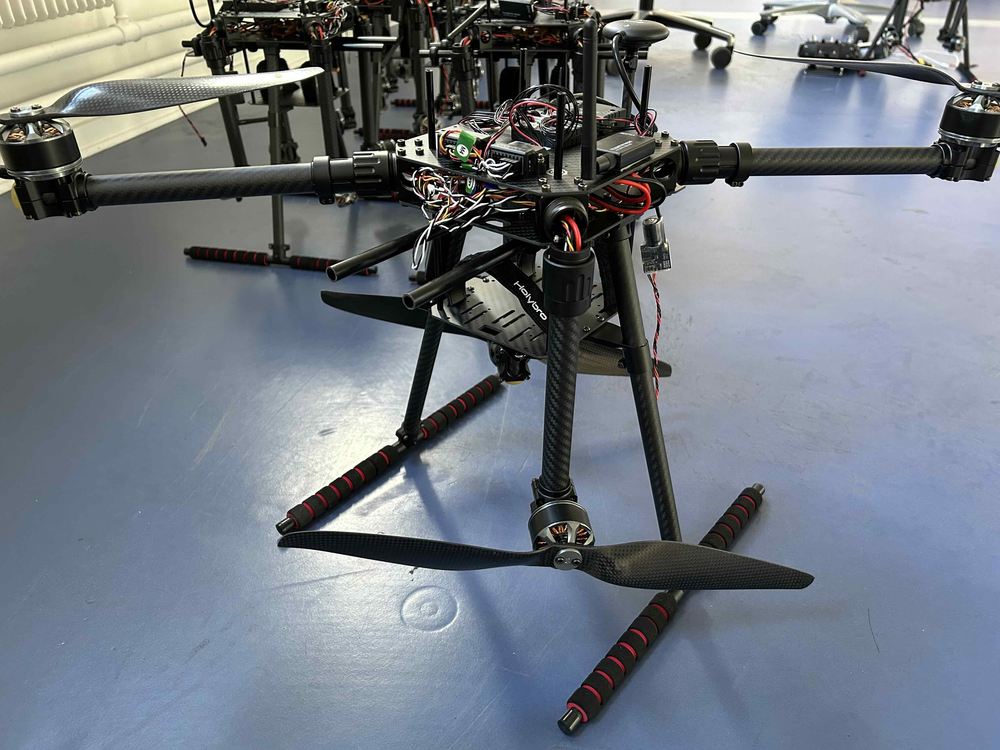

Holybro [X650]((https://holybro.com/collections/x650-kits/products/x650-development-kit)) is a customisable drone platform can carry a total payload up to 3kg and fly 15-30min. The sizable deck and compatibility to standard software interface like PX4, Ardupilot and MAVLink make it easy to host various sensors and onboard computing resources for richer applications. 

Our team of Holybro X650 is with the Pixhawk 6C flight controller. Check out the official [documentation](https://docs.holybro.com/autopilot/pixhawk-6c/overview) about how to use it with a radio control/telemetry from a ground computer. Typically the control range allows for 300m or several kilometers with the use of a patch antenna on the ground. There are no video transmission systems at the moment though, so try to avoid fly out of sight. 

__WARNING__: Holybros are full-sized drone platforms and you should be absolutely careful when flying with them. Contact the lab manager if anything is in doubt. You will also need certificates according to the drone [regulations](https://www.en.droneregler.dk/drone-regulations-in-denmark) in EU/Denmark.