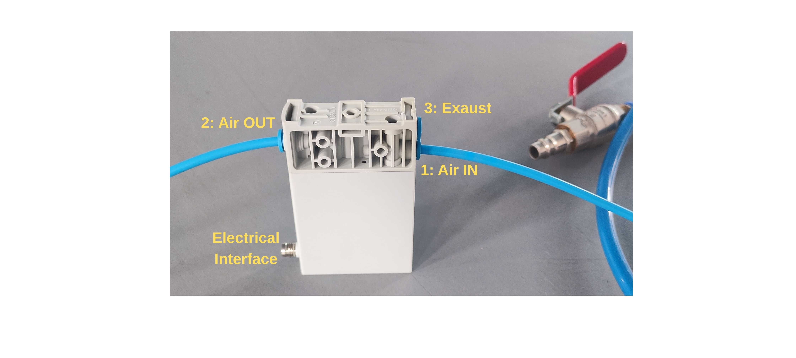

# Version 2 – Pneumatic Control Setup with UR control box

## Overview

This setup integrates robot arm and pneumatic grip in a single framework featuring a unified python interface.  The setup consists of the componetnts listed below.
- **Universal Robot control box**: Electrical Interface with standalone tablet controller and ethernet/WiFi control through code API
- **Robot arm**: UR5e with 3d Printed support to attach the piab-suction cups, Raspberry Pi and two attached Picametas and a.  
- **Air supply**: Compressed air source
- **Pressure regulator**: FESTO proportional-pressure regulator (8046299) maps an input voltage to a proportional pressure of air in output.  
<div>

</div>

- **Suction pump**: Pump piCOMPACTx10 (6-channel) vacuum pump attached to the suction cup. ON/OFF suction with energy saving control.  
<div>

</div>
  
## Electrical Connections
PLOT

## Pneumatic Connections
PLOT

## Digital Interface
- Pressure Regulator (0–10 V → 0–6 bar / 0–87 psi) → **UR control box Analog Output 0 (AO0)** 
- Suction pump (ON/OFF) → **UR control box Digital Outputs (DO0:blow, DO1:suck)**


## Python Example
The following Python script:  
1. Opens the regulator fully (10 V).  
2. Cycles the pump ON and OFF for 10 repetitions with a 2-second interval.  
3. Logs regulator voltage and corresponding pressure in real time.  
4. Allows selection between `"suck"` and `"blow"` modes (depending on which pump channel is wired).


```python
import rtde_io
import rtde_receive
import time

IP = "ROBOT_IP"
_io = rtde_io.RTDEIOInterface(IP)
_r = rtde_receive.RTDEReceiveInterface(IP)

# Open regulator fully (10 V mapped to ~87 psi / 6 bar)
_io.setAnalogOutputVoltage(0, 1.0)  # 1.0 = 10 V (range is 0.0–1.0)

def to_psi(V):
    """Convert pump voltage reading to pressure in psi."""
    return (V - 4/5) * 53.0657  # Adjusted calibration

def regulator_to_psi(V):
    """Convert regulator voltage (0–10 V) to pressure in psi (0–87)."""
    return (V / 10) * 87

pressure, voltage = [], []

def wait_and_log(seconds):
    """Log regulator input and corresponding pressure for 'seconds' duration."""
    counter, step = 0, 0.01
    while counter < seconds:
        v = _r.getStandardAnalogInput0()
        voltage.append(v)
        pressure.append(to_psi(v))
        time.sleep(step)
        counter += step

def print_pin_state(pin):
    """Print the current digital output pin state."""
    state = _r.getDigitalOutState(pin)
    print(f"Pin {pin} is {'HIGH' if state else 'LOW'}")

# Choose air flow mode: 'suck' or 'blow'
mode = "suck"
if mode == "blow":
    pin = 0
elif mode == "suck":
    pin = 1
else:
    raise ValueError("Invalid mode. Use 'blow' or 'suck'.")

seconds = 2
for i in range(10):  # ten on/off cycles
    _io.setStandardDigitalOut(pin, True)   # Pump ON
    wait_and_log(seconds)
    _io.setStandardDigitalOut(pin, False)  # Pump OFF
    wait_and_log(seconds)
```


# Version 1

[Piab](https://www.piab.com) provides vacuum technologies for lifting and moving objects in automation applications. The lab space has received a package of vacuum cups and soft grippers that may suit different payloads and object geometries. The grippers can be connected to robot arms such as [UR5e](./ur5e) and actuated with vacuum ejector (the red aspirator in the picture) or piCOMPACT I/O link (the device in the picture). Note you would need air compressor as in the picture below and pneumatic solenoid valves to control on/off of the grip. Consult the lab manager on how to use them properly.


<div>


</div>


The lab has sufficient gadgets to build circuits to control the air flow and hence the on/off of grip from a computer. As a demonstrated example, you may find a setup in a plastic box using Aruidno, power control and valves to do so. 


<div>


</div>


Note that the valves is drive by 12V power so we cannot directly connect them to the output pins of Arduino (some motor control boards might be fine though). The power control here serves as a switch that allows us to use small electric currents to signal on/off of larger currents. 


We can use serial port to communicate with Arduino to trigger the on/off action. On the arduino side, we may simply use a code snippet:


```cpp

const int airvalvePin = 8;

int commandByte;


void setup(){

    Serial.begin(9600);

    pinModel(airvalvePin, OUTPUT);

}


void loop(){

    if(Serial.available() > 0){

        commandByte = Serial.read();


        if(commandByte == 'O' || commandByte == 'o'){

            digitalWrite(airvalvePin, HIGH);

        }

        if(commandByte == 'C' || commandByte == 'c'){

            digitalWrite(airvalvePin, LOW);

        }

    }

}

```


While on the computer side, we can use python to write to the serial port:


```python

import serial

import time


ser = serial.Serial('/dev/ttyACM0', 9600)   #check the port identifier on your computer

time.sleep(1)


while True:

    try:

        cmd = input("Input O or C to open or close the valve...")

        if len(cmd) > 0:

            ser.write(str.encode(cmd[0]))

    except KeyboardInterrupt:

        print("Exit the loop and close the serial.")

        break


ser.close()

```


A good practice could be wrap the serial communication into a grip() function. Note that valve-on means closing the gripper or activating the suction since the compressed air is used to create vacuum. You might want to name the command differently if that creates confusion.

