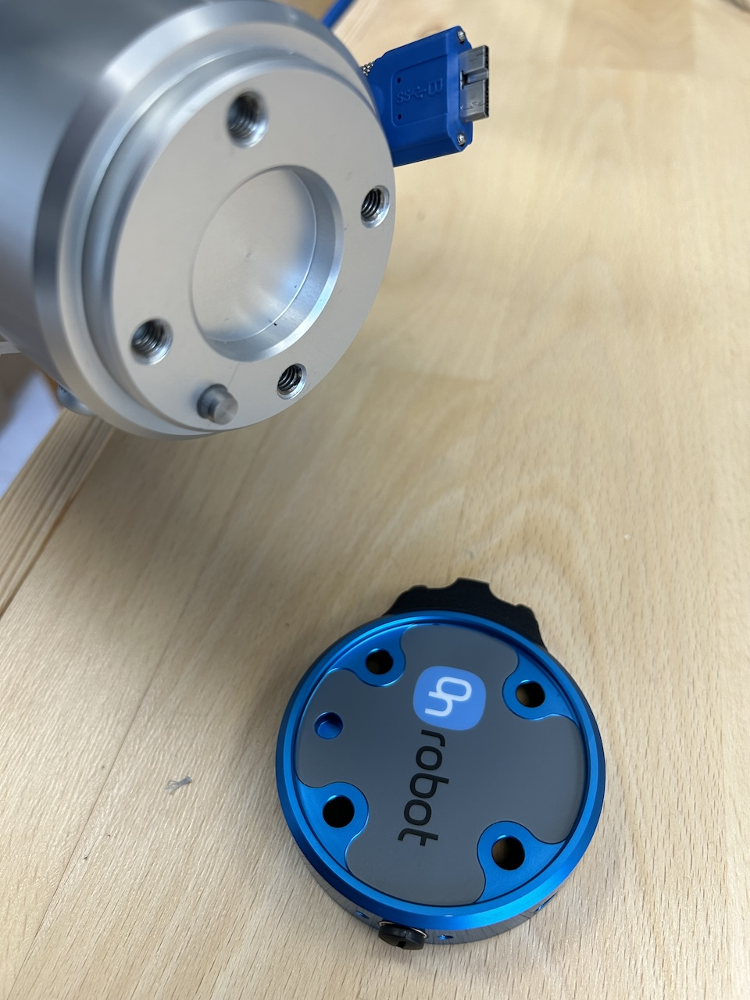
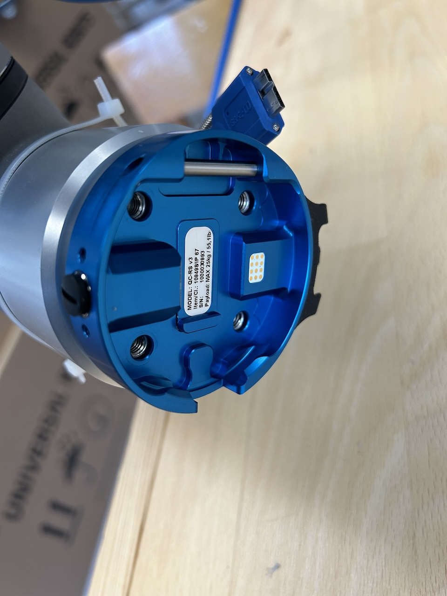
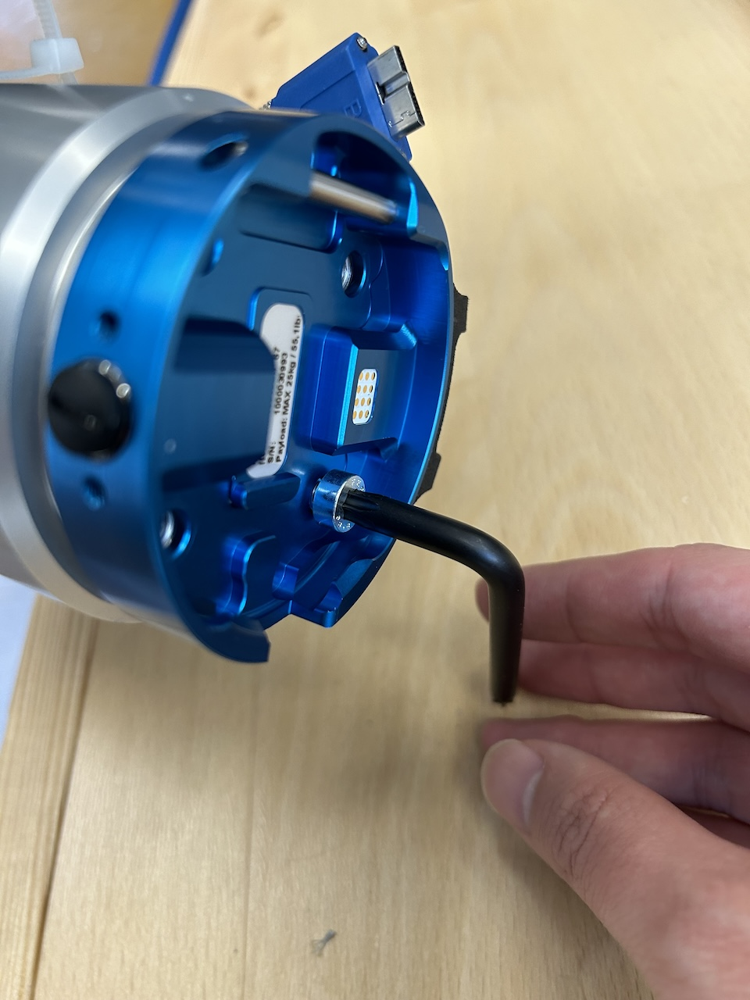
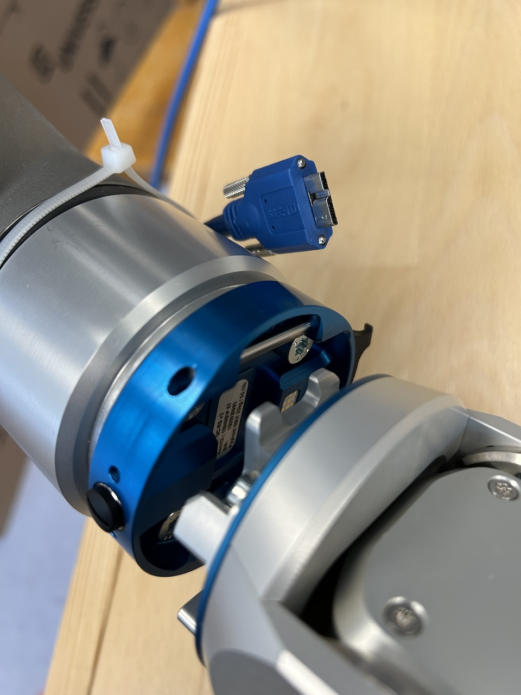
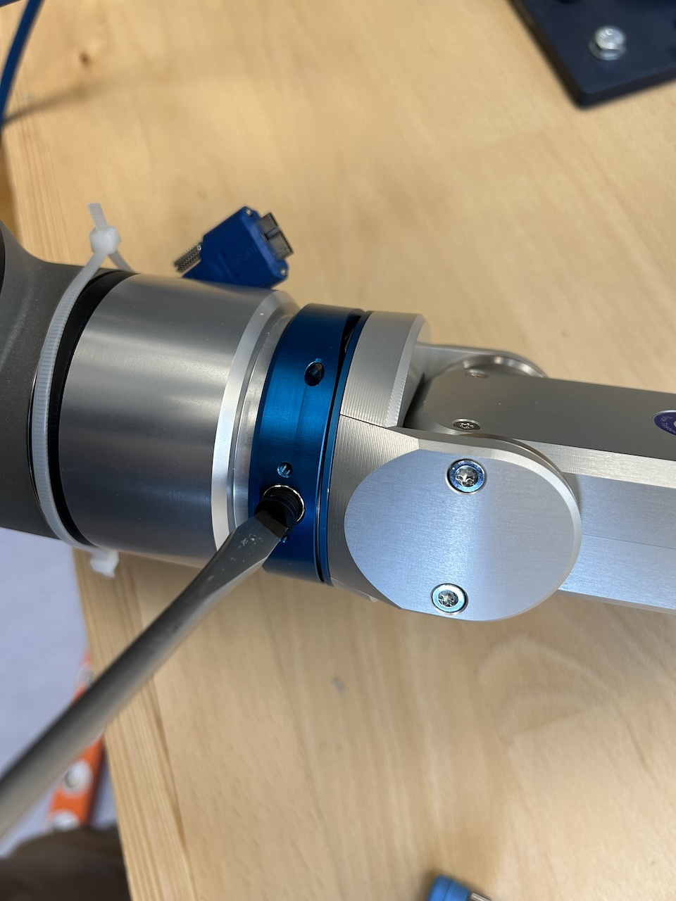
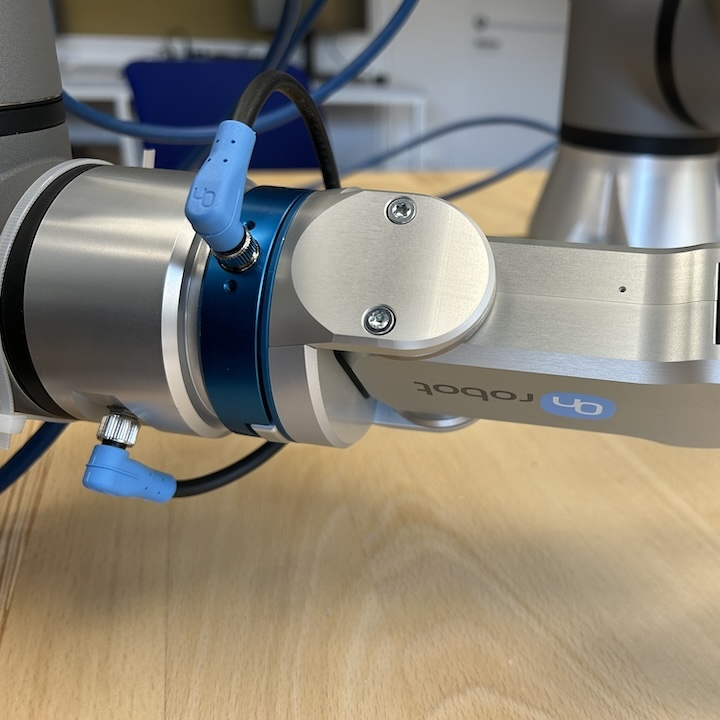

OnRobot RG2 is eletric two-fingered gripper that supports a max grasp width of 110mm and 2kg/5kg for force/form grip. The lab space has mount adapters and cables for using it together with [UR5e](./ur5e). This includes commanding grasp width and force through teach pendant or remote computer. This page contains a short description about mounting/unmounting, setup and programming with python on the remote computer. A full user manual can be found from [the official website](https://onrobot.com/en/downloads).

## Mount/Unmount RG2 to/from UR5e

* Mount the flange adapter to UR5e. Use the pin to ensure the alignment of holes.

<div>


</div>

* Tighten four screws to fix the adapter. Mount RG2 gripper to the adapter. Note to mate the rod and hook tongue first and there will be a click sound indicating the gripper is fully mounted. Gently push the gripper to ensure the lock mechanism works as intended.

<div>


</div>

* Unscrew the socket covers on the flange adapter and robot arm. Plug the sockets with the kit cable so the grippers can be controlled through the robot I/O. 

<div>


</div>

* To unmount the gripper, press the button between the gripper and flange adapter and then reverse the mounting motion.

## Software Setup

Using robot I/O to control the gripper needs to install URCap to the teaching pendant. This should be done already on the lab robots. To verify it, find the URCaps on teach pendant from Installation->URCaps->OnRobot Setup. If the URCap is not there and an installation is needed, use the USB stick in RG2 boxes and follow the instructions from the user manual. The OnRobot Setup should show some IP address information indicating whether the gripper is correctly configured and ready to use. If the device info is not green, check the error information and resolve them:

* The robot needs to be powered up so its tool side (whatever mounted as the robot end-effector) is powered.
* Navigate to Installation->General->Tool IO and changed the item in "Controlled by" to "OnRobot". Save this installation together with other setup so if this should be reused many times.
* Now the gripper should be controlled by teach pendant (need to activate the robot of course). Go to Program->URCaps and add a RG Grip program. You may specify a target width and grip force and then click the play button to execute the command.

## Programming from a Remote Computer

Ideally, one would like to control the grip/release of the gripper from a remote computer, e.g. with Python/C++ APIs. Unfortunately, no official support seems to be there. There are, however, solutions discussed in the community.

### ur_rtde

ur-rtde provides APIs to command the robot and read/write I/O interfaces. The command is exclusive to UR5e itself so we will need an extended script to run on the controller, listening to certain I/O port and then executing the URCap function accordingly. There are two ways of running such an extended script on controller/teach pendant, see [the issue and related discussion on ur_rtde](https://gitlab.com/sdurobotics/ur_rtde/-/issues/108). The lab space has implemented the manually loaded custom script solution as the other is facing some problem of setting a local script, possibly related to [an active issue](https://gitlab.com/sdurobotics/ur_rtde/-/issues/297). 

Basically, all have to do is to open a script named "robot_control_plus_rg2.script" on the teach pendant and run it. The script is largely credited to the discussion [here](https://gitlab.com/sdurobotics/ur_rtde/-/issues/100). ur_rtde also requests to switch to "remote control mode" from "local mode". To do this, tap the icon like the teach pendant close to the upper right corner on the screen.

The script listens to the integer register 18 to call the URCap RG2 function, which can receive both grip width and force values. The two values can be specified by writing to float register 18 and 19. With all that in mind, we can write a snippet of python code to control both UR5e and the gripper via ur_rtde:

```python
import time
from rtde_control import RTDEControlInterface
from rtde_io import RTDEIOInterface

rtde_c = RTDEControlInterface("192.168.3.102", 100, RTDEControlInterface.FLAG_CUSTOM_SCRIPT)    #use the actual robot controller IP here
rtde_io = RTDEIOInterface("192.168.3.102")  #use the same robot controller IP here

for _ in range (5):
    rtde_c.moveL([0.435, -0.143, 0.30, -0.001, 3.12, 0.04], 0.5, 0.3)
    rtde_c.moveL([0.635, -0.143, 0.30, -0.001, 3.12, 0.04], 0.5, 0.3)


    rtde_io.setInputDoubleRegister(18, 15.0)    #width
    rtde_io.setInputDoubleRegister(19, 15.0)    #force
    rtde_io.setInputIntRegister(18, 1)          #execute

    time.sleep(0.5)
    rtde_io.setInputIntRegister(18, 0)          #finish execution

    rtde_c.moveL([0.635, -0.343, 0.30, -0.001, 3.12, 0.04], 0.5, 0.3)
    rtde_c.moveL([0.435, -0.343, 0.30, -0.001, 3.12, 0.04], 0.5, 0.3)


    rtde_io.setInputDoubleRegister(18, 75.0)    #width
    rtde_io.setInputDoubleRegister(19, 15.0)    #force
    rtde_io.setInputIntRegister(18, 1)          #execute
    time.sleep(0.5)
    rtde_io.setInputIntRegister(18, 0)          #finish execution
```

The above program simply repeats a sequence of linear motions and grip/release actions. Specifically, the code writes width and force and sends a signal to execute the commanded values. Note the signal needs to be revoked afterwards. Otherwise the gripper branch will block listening to other UR5e API calls (should be improved on the script side). A good practice could be packing the register writing operations in some "grasp()" and "release()" functions in a Robot class.

### ROS Driver

*Under construction*