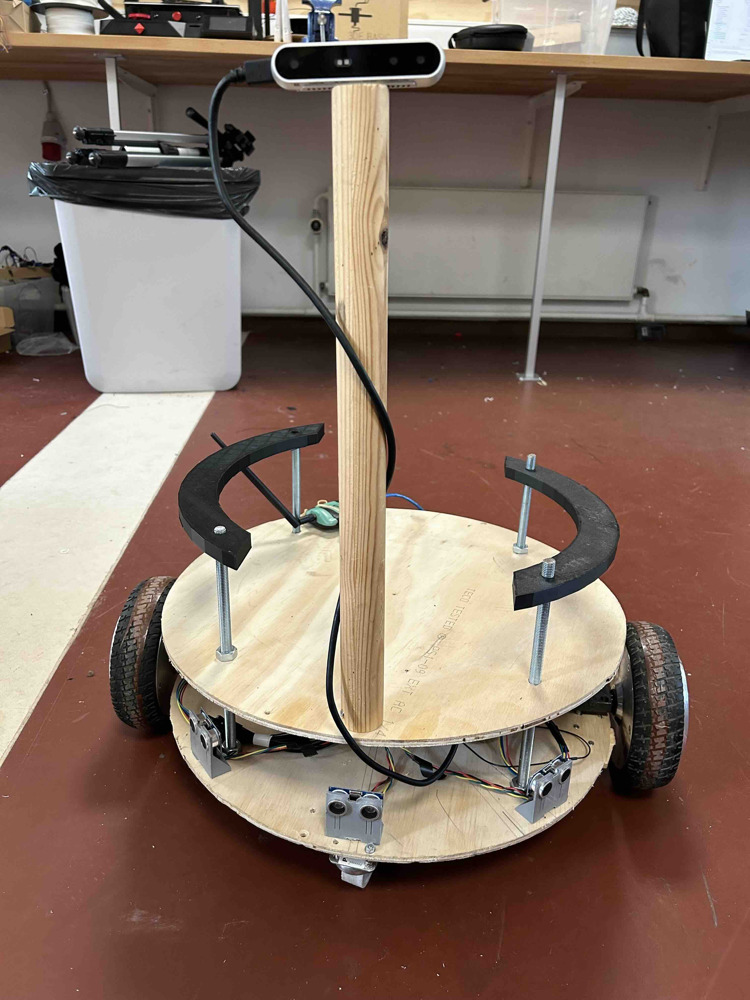

Template for Experimental Robotic Research and Applications (TERRA) is a home-made mobile robot with inspirations from [a project at Cornell University](https://dl.acm.org/doi/10.1145/3568294.3580206) and the Arlo robots. It is produced as a master thesis work by [Stefan Kröll Rasmussen](https://github.com/SKroell/TERRA-bot). 

The robot is powered by the chasis of a hoverboard so it can operate under considerable payload for more than 5 hours. It equips a piece of Rasberry Pi 5 with ROS2 installed, supporting web access to an onboard camera and motion commands from a remote computer. The main purpose of Terra is for human-robot interaction research, e.g. in open space environments, for its long battery lifespan and full possibility of customization. It may also be used as a substitute when you seek to use Arlos for your project while they are occupied by teaching activities. 

