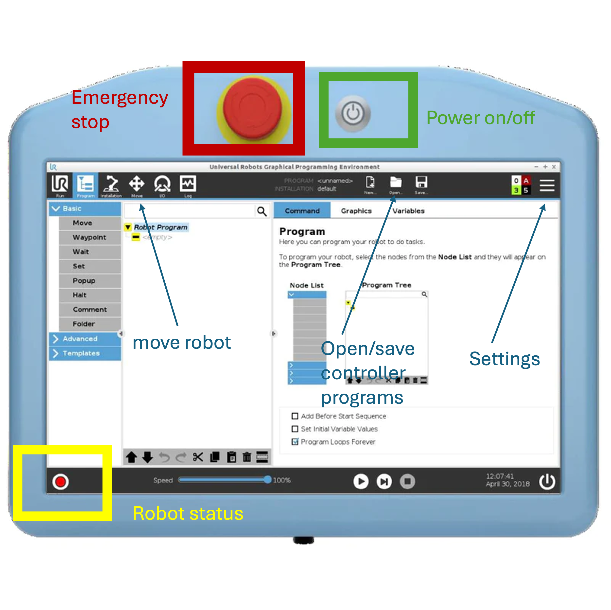

# Universal Robotics UR5e Cobots
UR5e robots are light-weight collaborative robot arms with 6 joints and can move a payload up to 5kg with submillimeter-level motion accuracy. E-series indicate the model is shipped with embedded force-torque sensor that could be used for certain taskes. There are so far 3 UR5e robots in the labspace connected to the lab network hub. This page provides a brief introduction on how to use the robot and program them with the lab or your own computers (often referred as __remote computer__). Refer to [the official user manual](https://www.universal-robots.com/download/manuals-e-seriesur20ur30/user/ur5e/59/user-manual-ur5e-e-series-sw-59-english-international-en/) for more extensive descriptions.

## Basic Usage
The basic interaction with UR5e can be done via the teach pendant attached to the control box (usually referred as __controller__). Picture and instructions below show the basic steps to use it:

* Turn on/off robot controller: press the button marked in the picture.
* Robot status: Red - robot is not powered -> Yellow - robot is powered but not motors are not active -> Green - motors are active and can be commanded. Robot can only be moved while the status is green. Just use the button on the touch screen. A strand of sound of unlocking joint brakes will be heard while activating the robot, indicating it will be good to go.
* Open/Save controller program: open configuration or a control script to run. Note this is the script running on the __controller__ not on the __remote computer__. In most cases, this is for loading a setup, e.g. IP adress of a __remote computer__, and scripts, e.g. ExternalControl, that the driver/library on the __remote computer__ will talk to.
* Move robot: switch to the tab and use a GUI to move the robot upward/downward/left/right or each joint individually. There is also a home button to drive the robot back to the up-straight pose. Remember to shutdown the robot at the home position if the experiment setup wouldn't be used for an extended period of time. 
* Emergency stop button: smash it when the robot is moving in an unexpected way. This will mechanically brake and unpower the robot. __It is always a good practice to put your hand next to it before running your program__. Ask a peer for help when you could not due to other tasks.
* Settings: check and set various parameters, e.g. IP address of __controller__ in the network. The address is needed for configuring the driver or the program to use on the __remote computer__. 

## Progamming with UR5e 
UR5e supports to run C++/Python programs on a __remote computer__ via network connections. The connections can be a direct ethernet cable between __controller__ and __remote computer__, or via a router/switch linking __controller__, __remote computer__ and potentially other devices in a same network. It is recommended to use ethernet cable to connect laptop/workstation to the hub. WIFI may also be fine for certain applications but it can be unstable with a latency up to more than 100ms.

The C++/Python APIs are provided by a few libraries can be found online:

* [Official ROS driver](https://github.com/UniversalRobots/Universal_Robots_ROS_Driver): this is an integral part of [Robot Operating System (ROS)](https://www.ros.org) that will allow accessing a wide range of ROS packages for motion planning, sensor processing, diagnosis and visualization tools. You will need to install ROS on the __remote computer__ (supporting Ubuntu/Mac/Windows, traditionally ubuntu is preferred). This is favoured for applications entailing communication across multiple processes on internal/external devices and heavy computation, e.g. you may want to distribute large neural network inference and real-time control of robots to separated computers.   
* [SDU ur_rtde](https://gitlab.com/sdurobotics/ur_rtde): this is an unofficial wrapper of UR [RTDE](https://www.universal-robots.com/articles/ur/interface-communication/real-time-data-exchange-rtde-guide/) data protocol for users to quickly write C++/Python code. It depends on nothing more than basic Ubuntu programming toolchain. This is thus most suitable for small-to-middle scale tasks where only basic motion APIs and limited sensor processing are needed.

__Note on real-time kernel__: Both ROS driver and ur_rtde recommend to use a realtime kernel that would need recompilation or turn on some experimental feature on Ubuntu 22.04. This may be unnecessary unless cutting-edge performance is needed (UR5e can support a control frequency up to 500Hz). That said, one of the workstations in the lab has ROS driver with a real-time kernel compiled and configured. This will allow your application to communicate with this machine over ROS to control the robot. Ask the lab manager if this was needed.