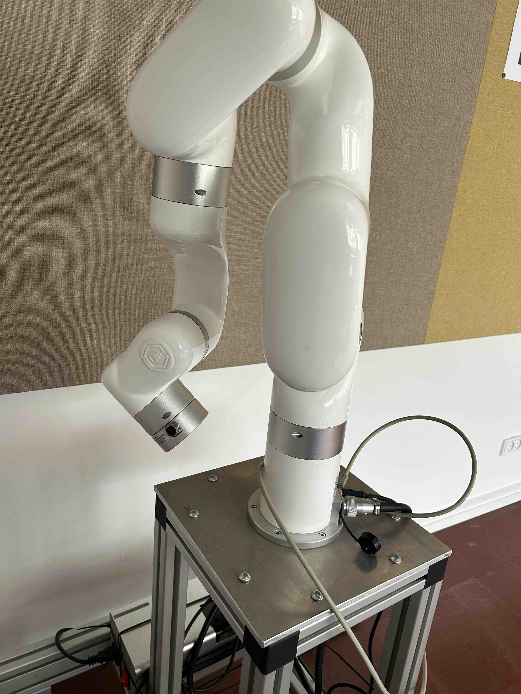

UFactory xArm6 is among a series of light-weight multi-DOFs robots with simple programming interface. It has 6 revolute joints and 5kg payload, with a repetitive accuracy of 0.1mm. The official repository contains a rich document about programming it with [python SDK](https://github.com/xArm-Developer/xArm-Python-SDK) or [ROS](https://github.com/xArm-Developer/xarm_ros2). The remote computer can be connected to the robot via a network and a direct cable if low latency is desired.

